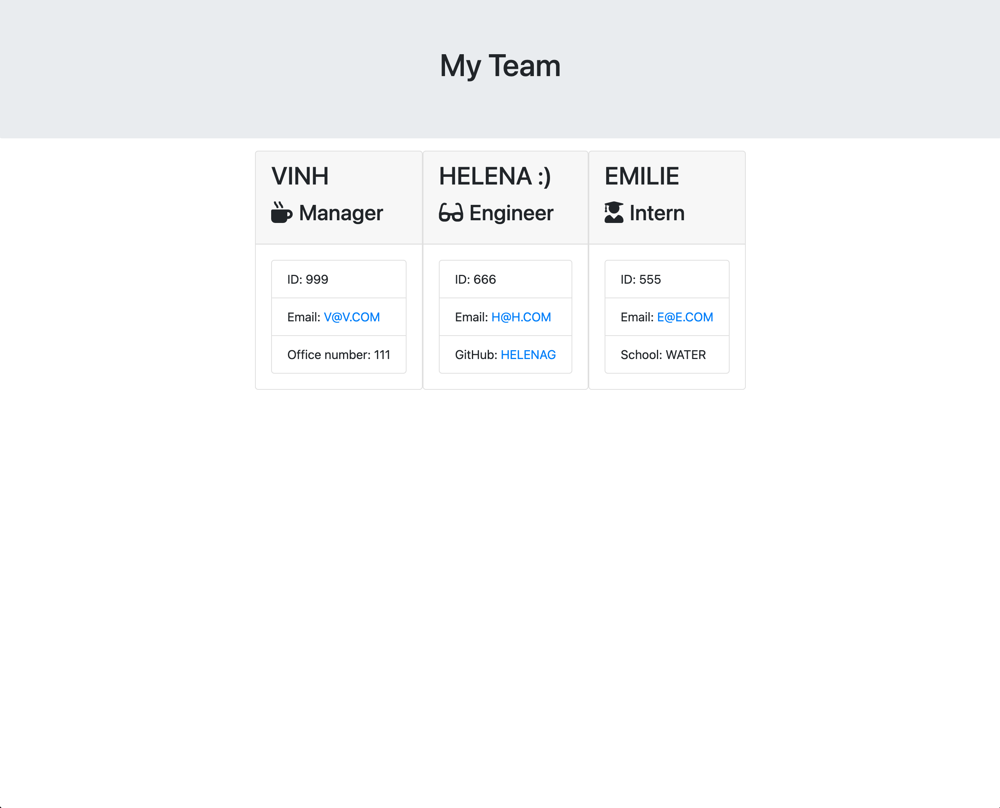

# DieselTeamProfileGenerator

## Description

This project is a command-line application that accepts user inputs and generates a web pag.

## Installation

To install the application you will need to:

1. Clone the repository -> [Github respository](https://github.com/VinhKietLa/DieselTeamProfileGenerator)
2. Install NodeJS v19.6.1 -> [NodeJs](https://nodejs.org/en/download/)
3. Install Inquirier v8.2.5-> [Inquirer](https://www.npmjs.com/package/inquirer)
4. Use the command 'node index.js' to start the application.

## Preview of application

### Technologies used

- NodeJS 
- Javascript
- Inquirer
- FS Library
